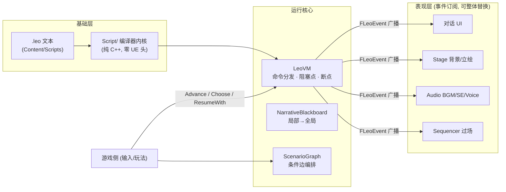

# LeoNarrative

**UE 5.8 叙事 / ADV（视觉小说）游戏框架** —— 剧本用自研 `.leo` 文本语言书写，AI 优先创作是第一设计目标；编译器内核纯 C++ 可脱离引擎单测，运行核心事件驱动，表现层整体可替换。

`UE 5.8 · .leo 语言 v0.11 · 宿主内核测试 27/27 · LeoValidate 语料全绿`

---

## 特性

- **`.leo` 文本剧本**：行式命令 + 位置/命名参数 + C 系表达式，文本是唯一事实源（永不落盘派生物），对 AI 生成 / diff / 版本管理天然友好
- **纯 C++ 编译器内核**（`Script/`，零 UE 头文件）：编译期全量校验（错误带行号），秒级独立单测，无头 CI 可用
- **事件驱动 VM**：text/wait/choice 内置阻塞点 + **玩法断点泛化**（`Suspend(token)` / `ResumeWith(token, payload)`），外部永不直接驱动 VM 指针
- **分层黑板**：局部（每章）→ 全局（跨周目）自动回落，`OnValueChanged` 委托
- **表现层可替换**：VM 只广播事件；框架自带 Stage / Audio / Sequencer 适配器与纯 C++ 对话 UI，可整体换成你自己的
- **框架预注册 `seq` 命令**：Level Sequencer 过场一行接入（播完回传断点，缺资源永不软锁）
- **自定义命令扩展点**：严格 spec 编译期校验参数 + 处理器三态返回（Next / Suspend / Halt）——任何非 VN 玩法段零框架改动接入
- **ScenarioGraph 编排**：数据资产定义"节点（章节+label）+ 条件边（.leo 表达式）"，多章节流程图
- **双档存读**：进度档（图位置 + VM 锚点 label+offset + 局部黑板快照）与全局档（已读文本 + 全局变量）分离；锚点对文本插行鲁棒
- **编辑器工具链**：剧本热校验 watcher、校验中心面板（含清单/资产引用核对）、叙事调试器面板（VM/黑板/事件流/手动驱动/存档查看）
- **CI 三件套**：`LeoValidate` 校验命令行 · `LeoRun` 无头运行器（命令行创建 GameInstance 泵帧整章回归）· golden 语料 + 纯内核宿主测试

## 架构



三条铁律（改代码前必读，详见 `docs/leo-spec.md`）：

1. `Script/` 内核纯 C++，不 include 任何 UE 头文件，必须可脱离引擎单测
2. 剧本里的资源一律写**逻辑名**，经 `ULeoAssetManifest` 清单映射到资产路径——脚本永不出现 `/Game/...`
3. VM 只广播事件、不触碰 Widget/资产；表现层因此整体可替换

## 快速开始

### 1. 安装

- 把本插件放进工程 `Plugins/LeoNarrative`，重启工程编译
- 打包配置（`Config/DefaultGame.ini`）追加，剧本才会进包：

```ini
[/Script/UnrealEd.ProjectPackagingSettings]
+DirectoriesToAlwaysStageAsUFS=(Path="Scripts")
```

### 2. 写第一个剧本

在 `<工程>/Content/Scripts/hello.leo`（文件名 = 章节 ID）：

```leo
bg bg_school_room
bgm bgm_daily01 volume=0.8

label lab_start
text 李雷 | 早上好！今天也要一起回去吗？
choice
    当然可以 -> branch_yes
    沉默 -> branch_silent

label branch_yes
setg affection += 1
text 李雷 | 太好了，那我们在校门口见！
jump lab_ending

label branch_silent
text - | 沉默在走廊里延展开来。

label lab_ending
text - | 放学后的夕阳把地板染成橙色。
end
```

**保存即校验**（watcher 自动弹通知，错误带行号），或打开 *Tools → LeoNarrative → Leo 校验中心* 看全量诊断。

### 3. 资产清单（可选，正式项目建议）

Content 右键 → Miscellaneous → Data Asset → **`LeoAssetManifest`**，把剧本里的逻辑名映射到真实资产：

| 逻辑名 | 资产 |
|---|---|
| `bg_school_room` | 任意（背景，由你的 Stage 层解释） |
| `bgm_daily01` | `USoundBase`（含 MetaSoundSource） |
| `lab_intro_cut`（seq 用） | `ULevelSequence` |

校验中心会自动核对：逻辑名漏映射 / 资产不存在 / 类型不符（如 seq 指到声音）都是编辑期红字。无清单时降级运行（UI 占位、静音、seq 走兜底分支）。

### 4. 游戏侧接线（C++）

```cpp
#include "Subsystem/LeoNarrativeSubsystem.h"

if (ULeoNarrativeSubsystem* Leo = GetGameInstance()->GetSubsystem<ULeoNarrativeSubsystem>())
{
    Leo->SetManifest(ManifestAsset);          // 可选
    Leo->ShowDialogueUI(true);                // 内置对话 UI（或接你自己的）
    Leo->StartChapter(TEXT("hello"));         // 单章直跑；多章节用 StartGraph(图资产)
}
```

玩家输入驱动（对话点击 / 选项回调处）：

```cpp
Leo->Advance();          // 推进一句
Leo->Choose(0);          // 选择第 0 项
Leo->SkipSequences();    // 跳过当前过场
```

读档续跑：`Leo->SaveProgress(); Leo->SaveGlobal();` / `Leo->LoadProgressAndResume();`

## `.leo` 语言速览

14 个内置命令（完整规范见 **`docs/leo-spec.md`**）：

| 命令 | 用法示例 | 说明 |
|---|---|---|
| `label` | `label lab_start` | 跳转锚点（存档锚点 = 最近 label + 偏移） |
| `text` | `text 李雷 \| 你好！` | 对话（阻塞等点击）；`- \|` 为旁白 |
| `bg` / `char` | `bg bg_room` · `char 李雷 char_smile at=left` | 背景 / 立绘（`-` 表示移除） |
| `bgm` / `se` / `voice` | `bgm bgm_daily01 volume=0.8 fade=1.0` | 音频（逻辑名经清单解析） |
| `wait` | `wait 500` | 计时阻塞（毫秒） |
| `jump` / `jumpif` | `jumpif affection >= 2 -> good_end` | 无条件 / 条件跳转（C 系优先级，不可链式比较） |
| `set` / `setg` | `setg affection += 1` | 局部 / 全局黑板写入 |
| `choice` | 4 空格缩进，`选项文本 -> label`，可带 `if 条件` | 阻塞等选择；结果写黑板 `last_choice` |
| `end` | `end` | 该执行路径终止（全文件至少一个，允许多个） |

框架预注册的演出命令：

```leo
seq lab_intro_cut wait=1 rate=1.0 start=0 loop=0
jumpif seq >= 1 -> cut_done      # seq 键 = 1 自然播完 / 0 缺资源或被跳过
```

严格类型语义：无 truthy 强转、未定义变量读取是运行时错误、`&&`/`||` 短路求值。缩进 4 空格（**Tab 即编译错误**），`#` 整行注释。

## 扩展：自定义命令与玩法断点

任何非 VN 玩法段（调查 / QTE / 战斗入场）走同一条流水线，**零框架改动**：

```cpp
// 1) 严格注册：参数错误在编辑期报出（带行号）
LeoBridge::FLeoCmdSpec Spec;
Spec.Name = TEXT("investigate");
Spec.MinArgs = 1;  Spec.MaxArgs = 1;
Spec.AllowedParams = { TEXT("mode") };
ULeoVM::RegisterCustomCommand(TEXT("investigate"), Spec,
    [](ULeoVM& VM, const leo::FLeoCommand& C) -> ELeoCustomResult
    {
        VM.EmitCustomEvent(C);              // 广播 Custom 事件（参数袋 ExtraParams）
        VM.Suspend(TEXT("investigation"));  // 挂起为外部断点
        return ELeoCustomResult::Suspend;
    });

// 2) 玩法完成后回传：payload 写局部黑板键 <token>，脚本 jumpif 分流
Leo->ResumeWith(TEXT("investigation"), leo::FLeoValue::MakeInt(2));
```

```leo
investigate scene_office mode=strict
jumpif investigation >= 2 -> lab_solved
```

完整示例：`Source/LeoNarrative/Private/Examples/LeoInvestigationDemo.cpp`。
`seq` 本身就是用这套扩展点实现的（`Stage/LeoSequencerPerformer.cpp`）——演出类阻塞与玩法类阻塞是同一种东西。

## 编辑器与调试

| 工具 | 入口 | 用途 |
|---|---|---|
| 剧本热校验 | 自动（保存 .leo 时） | 编译诊断通知，0.5s 防抖 |
| **校验中心** | Tools → LeoNarrative | 文件 × 诊断面板；清单/资产引用核对；双击跳转 |
| **叙事调试器** | Tools → LeoNarrative | PIE 运行中：VM 状态、当前命令、双黑板、事件流（64 条环形缓冲）、手动驱动（推进/选择/断点恢复/跳过过场）、存档查看 |

运行时控制台命令（PIE / 游戏内 / LeoRun 通用）：

```
leo.start <章节>    leo.click         leo.choose <i>    leo.stop
leo.state           leo.save / leo.load                leo.reload
leo.autotest <章节> leo.graph demo    leo.demoseq       leo.demoinvestigate
leo.ui              leo.auto / leo.skip
```

## CI / 测试

```bash
# 1) 剧本校验（含 golden 语料回归 + 清单资产核对；退出码非 0 = 失败）
<Engine>/Binaries/Win64/UnrealEditor-Cmd.exe <uproject> -run=LeoValidate -stdout -unattended -nosplash
#    可选：-manifest=/Game/Path/To.Manifest 指定核对清单（缺省自动发现）

# 2) 无头整章回归（命令行创建 GameInstance 泵帧驱动，不依赖编辑器启动）
<Engine>/Binaries/Win64/UnrealEditor-Cmd.exe <uproject> \
  -run=LeoRun -exec="leo.autotest chapter01" -seconds=15 -stdout -unattended -nosplash -nullrhi

# 3) 纯内核宿主测试（无引擎 / 无 UBT，秒级）
cd Plugins/LeoNarrative && cmd /c tests\run_host_test.bat
```

golden 语料：`tests/golden/pass`（必须零错误）与 `tests/golden/fail`（必须报错——错误检测能力的回归锁）。

## 目录结构

```
Plugins/LeoNarrative/
├── Source/LeoNarrative/               # Runtime 模块
│   ├── Public|Private/Script/         #   编译器内核（纯 C++，铁律 #1）
│   ├── Public|Private/VM/             #   LeoVM + 事件模型
│   ├── Public|Private/Blackboard/     #   分层叙事黑板
│   ├── Public|Private/ScriptRuntime/  #   Registry 封装 + 导出桥（Bridge）
│   ├── Public|Private/Data/           #   清单 / 编排图资产类型
│   ├── Public|Private/Stage/          #   舞台 + Sequencer 适配器
│   ├── Public|Private/Audio/          #   音频适配器
│   ├── Public|Private/Presentation/   #   纯 C++ 对话 UI
│   ├── Public|Private/Save/           #   双档体系
│   ├── Public|Private/Subsystem/      #   会话门面 + 控制台命令
│   └── Public|Private/Examples/       #   调查模式扩展示例
├── Source/LeoNarrativeEditor/         # Editor 模块（校验/面板/watcher/命令行）
├── docs/leo-spec.md                   # 语言规范——唯一权威
└── tests/                             # golden 语料 + 纯内核宿主测试
```

## 状态

已完成 M0–M6 + M7 第一批（Sequencer / 编辑器 P0+P1），全部构建验证 + 无头回归通过。已知边界：

- 驱动接口（StartChapter / Advance 等）尚未加 `UFUNCTION`，入口代码需 C++
- 打包 staging 配置键已核对 5.8 源码，但尚未实际跑包验证
- 剧本内文本的本地化导出管道（TextId 体系已就位）在路线图上

路线图后续：图编辑器（GraphEditor）、本地化导出 commandlet、VSCode TextMate 高亮、ULeoScript 资产形态翻转（触发条件见 `docs/leo-spec.md`）。
